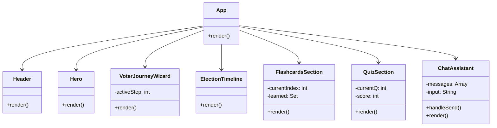

# Bharat Vote Assistant


Welcome to the **Bharat Vote Assistant**, an interactive and educational web application designed to help citizens understand the intricacies of the Indian electoral system. This application serves as a comprehensive guide, walking users through the voter journey, election timeline, and key electoral vocabulary, all supported by an AI-powered Chat Assistant.

## 🌟 Features

*   **Voter Journey Wizard:** A step-by-step interactive guide outlining the process from eligibility checks and registration to finding your polling booth and casting your vote.
*   **Election Timeline:** A visual representation of the election schedule, highlighting critical phases like Notification, Nomination, Campaigning, and Results.
*   **Interactive Flashcards:** Engaging 3D flip-cards to help you master electoral vocabulary (e.g., ECI, EVM, VVPAT, MCC, NOTA). Track your learning progress!
*   **Knowledge Quiz:** Test your understanding of the Indian electoral process with a short, interactive quiz that provides detailed explanations for correct answers.
*   **Election Sahayak AI:** An integrated chat assistant powered by Google Gemini AI. Ask questions about the election process, voting procedures, or specific terms, and receive instant, informative, and neutral responses.

## 🛠️ Technology Stack

*   **Frontend:**
    *   [React (CDN)](https://react.dev/) - For building the interactive user interface components.
    *   [Tailwind CSS (CDN)](https://tailwindcss.com/) - For rapid, utility-first styling and responsive design.
    *   [Lucide Icons](https://lucide.dev/) - For crisp, scalable vector icons.
*   **Backend:**
    *   [Node.js](https://nodejs.org/) & [Express](https://expressjs.com/) - For serving the application and handling API requests.
*   **AI Integration:**
    *   [@google/generative-ai](https://www.npmjs.com/package/@google/generative-ai) - To power the Election Sahayak AI using the Gemini model.
*   **Deployment:**
    *   Docker - Containerized for easy deployment (e.g., to Google Cloud Run).

## 📊 Architecture & Data Flow

The application follows a simple Client-Server architecture. The frontend is a React Single Page Application (SPA) that communicates with the Express backend for AI chat functionalities.

```mermaid
graph TD
    Client[User Browser - React SPA] -->|HTTP GET /| Server[Express Server]
    Server -->|Serves index.html, JS, CSS| Client
    
    Client -->|HTTP POST /api/chat (User Question)| Server
    Server -->|API Call| Gemini[Google Gemini API]
    Gemini -->|AI Response| Server
    Server -->|JSON Response| Client
```

### Component Structure



## 🚀 Getting Started

Follow these instructions to get a copy of the project up and running on your local machine for development and testing purposes.

### Prerequisites

*   [Node.js](https://nodejs.org/) (v16 or higher recommended)
*   npm (usually comes with Node.js)
*   A Google Gemini API Key (for the AI Chat functionality). Get one from [Google AI Studio](https://aistudio.google.com/).

### Installation

1.  **Clone the repository:**
    ```bash
    git clone https://github.com/MdFaisalDevops/prompt-project.git
    cd prompt-project
    ```

2.  **Install dependencies:**
    ```bash
    npm install
    ```

3.  **Set up Environment Variables:**
    *   Create a `.env` file in the root directory.
    *   Add your Gemini API key:
        ```env
        GEMINI_API_KEY=your_actual_api_key_here
        PORT=8080
        ```

4.  **Start the development server:**
    ```bash
    npm start
    ```
    Alternatively, on Windows, you can use the provided powershell script:
    ```powershell
    .\serve.ps1
    ```

5.  **View the application:**
    Open your browser and navigate to `http://localhost:8080`.

## 🐳 Docker Deployment

To build and run the application using Docker:

1.  **Build the Docker image:**
    ```bash
    docker build -t bharat-vote-assistant .
    ```

2.  **Run the container:**
    *(Make sure to pass your API key or include it in the environment)*
    ```bash
    docker run -p 8080:8080 -e GEMINI_API_KEY=your_api_key bharat-vote-assistant
    ```

## 📝 Demo Mode

If you run the application without providing a `GEMINI_API_KEY` in the `.env` file, the Chat Assistant will automatically fall back to a built-in "Demo Mode". In this mode, it will provide pre-programmed responses based on keywords (like 'process', 'mcc', 'evm', etc.) to ensure the UI remains testable and functional.

## 🤝 Contributing

Contributions, issues, and feature requests are welcome! Feel free to check the [issues page](https://github.com/MdFaisalDevops/prompt-project/issues).

## 📄 License

This project is created for educational purposes.

---
*Built with ❤️ to strengthen democracy through knowledge.*
